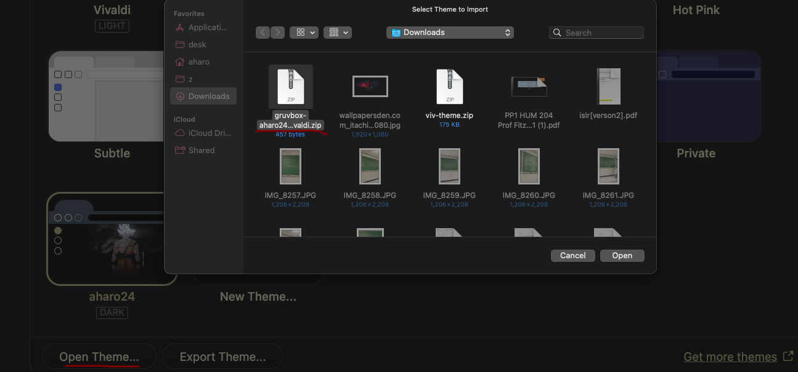

# dot-vivaldi
 This theme's color balance and sleek design will reduce eye strain for those who spend hours in front of the screen. 


# Requirement
...Step 1:
	Install `Homebrew`
```brew
/bin/bash -c "$(curl -fsSL https://raw.githubusercontent.com/Homebrew/install/HEAD/install.sh)"
```

...Step 2:

...`optional but STRONGLY recommended`
- #### [alacritty](https://github.com/aharo24/dot-alacritty)
- ### [starship](https://github.com/aharo24/dot-starship)


# Installation with Homebrew
#### ...Step 1:
Install vivaldi
``` brew
brew install --cask vivaldi
```

#### ...Step 2: 
- ### [download my zip](https://github.com/aharo24/dot-vivaldi/blob/main/resources/gruvbox-aharo24-vivaldi.zip)

#### ...step 3:
**open** 

### my zipped file



---
## [dotfiles](https://github.com/aharo24/opensource/tree/main/dotfiles)
- Please 
	- be patient (slowly merging all dotfiles for public use)

- [alacritty  ✅](https://github.com/aharo24/dot-alacritty)
- done
- exa
- fish-abbreviation-tips
- fish
- flameshot
- keycastr 
- obsidian
- raycast
- rectangle
- spunge
- [starship  ✅](https://github.com/aharo24/dot-starship)
- sublime
- tmux
- [vivaldi  ✅](https://github.com/aharo24/dot-vivaldi)
- z

---

## [Contact Info](https://github.com/aharo24/opensource)

Feel free to follow me on twitter: [@aharo24](https://www.twitter.com/aharo24)!

email me with any questions, improvements, bugs, or just to chat.
io.aharo24@gmail.com

